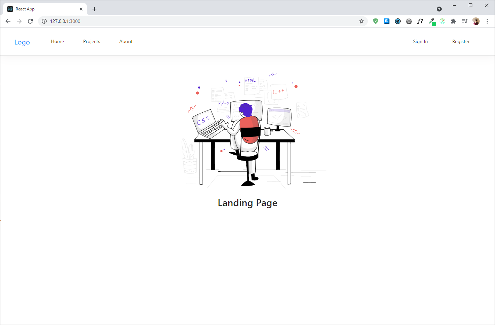
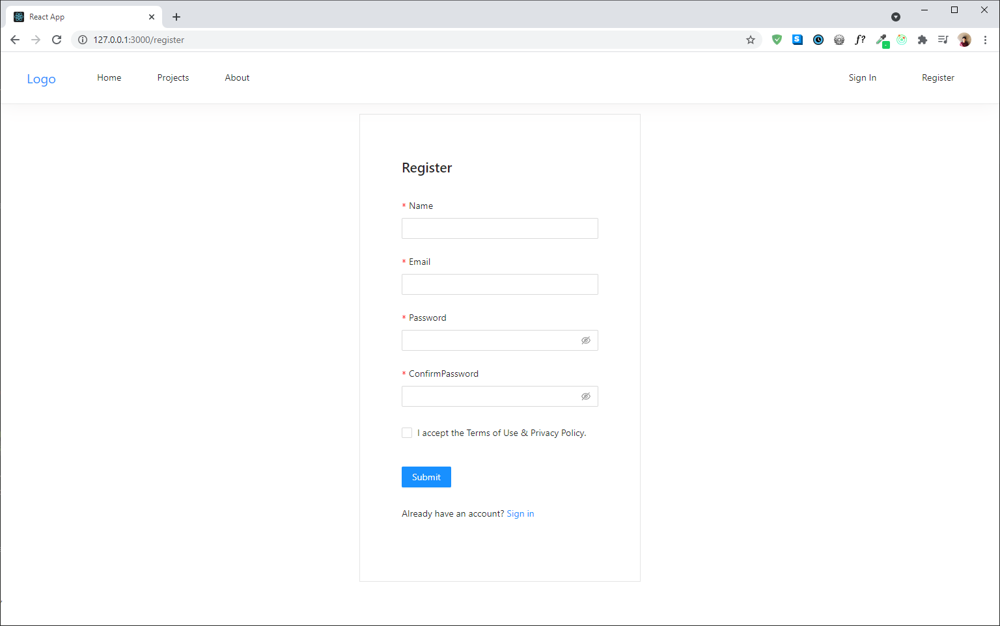
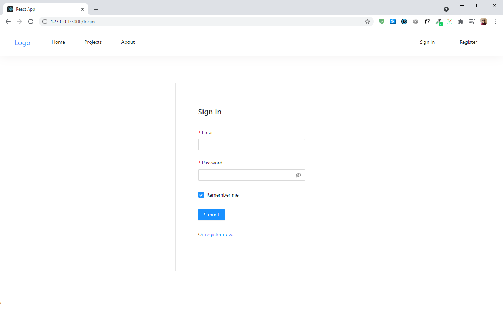
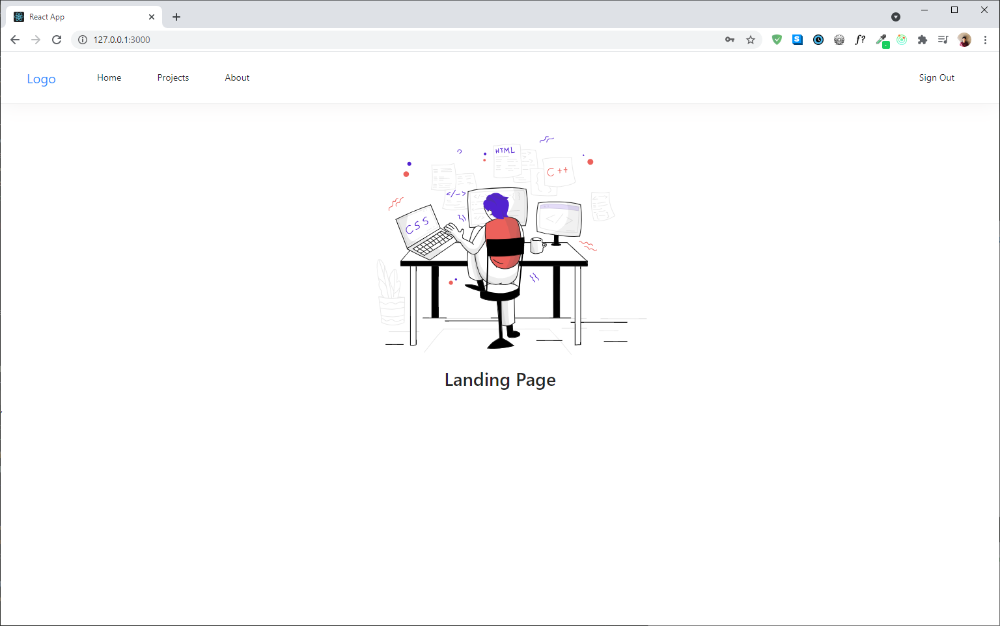
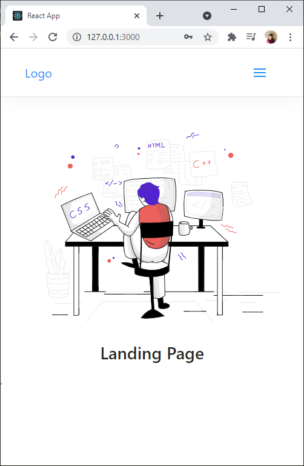
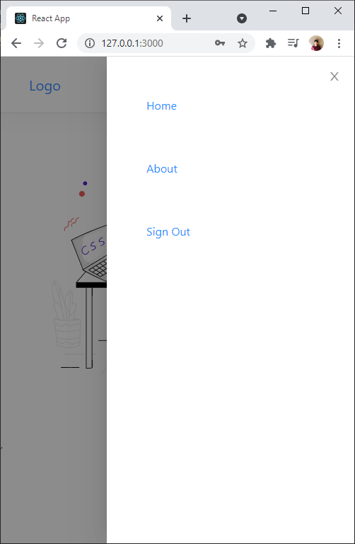

# nodejs-boilerplate

## Description

This is a simple web development boilerplate built with the MERN stack. The minimalistic template includes basic features like sign-in, sign-out, and register. The website is responsive and uses authentication to manage which users have access to which specific page and/or features. The boilerplate can be used as a starter template for various types of MERN projects.

## Installation

I used node.js version 14.16.0 and npm version 6.14.11.

```bash
nvm install 14.16.0
```

```bash
nvm use 14.16.0
```

## Usage

Clone the nodejs-boilerplate repository in your directory.

```bash
git clone https://github.com/byunsy/nodejs-boilerplate.git
```

Create "dev.js" file in /server/config directory and insert your mongoDB information.

```bash
module.exports = {
    mongoURI: "<information_goes_here>"
}
```

Go to the root directory and install all the requirements for the server-side.

```bash
npm install
```

Now go to the client directory and install all the requirements for the client-side.

```bash
npm install
```

## Demonstrations

Landing page when the user is not signed in.



The user can create an account using the register form.



The user can sign in.



Home page when the user is signed in. Notice that the navigation bar displays "Sign Out" now.



The website is also responsive.

|           Landing Page           |         Navigation Drawer         |
| :------------------------------: | :-------------------------------: |
|  |  |
